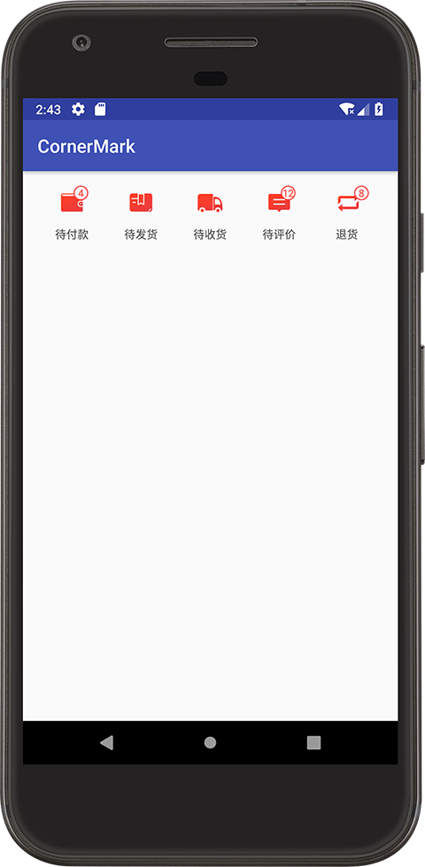

# CornerMark
[](https://jitpack.io/#xiaohu409/CornerMark)
## 概述
实现带数字角标的图标

效果图如下：


## 使用教程

1.在module的build.gradle引用类库
```groovy 
dependencies {
    implementation fileTree(include: ['*.jar'], dir: 'libs')

    implementation project(':cornermark')
}
```
或
```groovy
allprojects {
    repositories {
        ...
        maven { url 'https://jitpack.io' }
    }
}
```
```groovy
dependencies {
    implementation 'com.github.xiaohu409:CornerMark:1.0'
}
```
2.在xml布局文件里使用CornerMarkView控件
```xml
<LinearLayout
    android:layout_width="match_parent"
    android:layout_height="wrap_content"
    android:orientation="horizontal"
    android:padding="16dp">
    <com.hutao.cornermark.CornerMarkView
        android:layout_width="0dp"
        android:layout_height="wrap_content"
        android:id="@+id/to_pay_id"
        app:text="待付款"
        app:text_color="#555555"
        app:text_size="12sp"
        app:drawable="@drawable/me_icon1"
        app:num_color="#ff4a47"
        app:num_size="11sp"
        app:num_bg="@drawable/member_corner_mark_bg"
        tools:num="2"
        android:layout_weight="1"
        android:gravity="center" />
</LinearLayout>
```
3.在代码里实例化控件,并设置角标
```java
//初始化控件
CornerMarkView toPayView = findViewById(R.id.to_pay_id);
//设置控件的角标
toPayView.setNum(4);
//设置控件的点击事件
toPayView.setOnClickListener(this);
```
